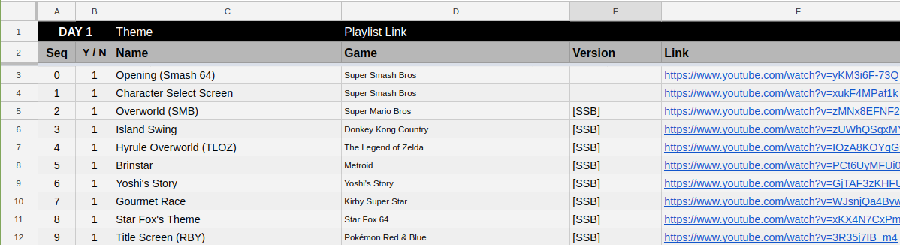

# Playlist Download

This code downloads a playlist assigning the name of the file acording to the columns in a .tsv file.
Considering $n the value of the column n, the name of each downloaded file would be:
"$1 $3 - $4 $5.mp3"

Example of expected table format:

Sequence | Download line (1) or not (0) | Name | Game (or album, idc) | Version | Link

# Usage

The code uses **youtube-dl** to download all files and it doesn't install it or update it.

Follow the official documentation to install or update **youtube-dl**: [https://github.com/rg3/youtube-dl/blob/master/README.md#installation](https://github.com/rg3/youtube-dl/blob/master/README.md#installation).

If a file named **playlist.tsv** is not found in the current directory, the script Retrieves the playlist's tsv from the last entry of  `ls ~/Downloads/*.tsv -1` and removes the first 2 header lines from the file.

Execution output generated by youtube-dl are redirected to **out.txt**. Every time the script is called, a separator line containing the full command and a timestamp is printed in **out.txt** to separate each execution output.

Error output generated by **youtube-dl** are printed in stdout along with all commands generated to download each line just before they're called.

All files are downloaded to the **/files** directory.

Using "/" and some other special chars on the sequence, title, serie and version fields may cause weird behaviours in the download. For example, "A/B" creates a file named A in a directory named B. This behaviour is done by youtube-dl itself so there's nothing to be done about it.

---

# Options

Marked lines are lines that contains the value 1 on the second column. If you don't want to download some lines, put 0 on their second column and run the script with the marked option
(marked option must come after the line selection option).

The script expects all line references to be indexed by 0, but it prints whatever value the first column (sequence) has. To reference lines when indexed by 1, just subtract 1.

---

- Download all lines

    `./down.sh -all`

- Download all marked lines

    `./down.sh -all -marked`

- Download all lines from i to j (indexed by 0)

    `./down.sh -seq i j`

- Download all of the marked lines from i to j (indexed by 0)

    `./down.sh -seq -marked i j`

- Download not sequential lines i, j and k (unlimited amount of lines)

    `./down.sh -each i j k`

- Download not sequential lines i, j and k if marked (unlimited amount of lines)

    `./down.sh -each -marked i j k`

- Download single line i (marked or not)

    `./down.sh i`
